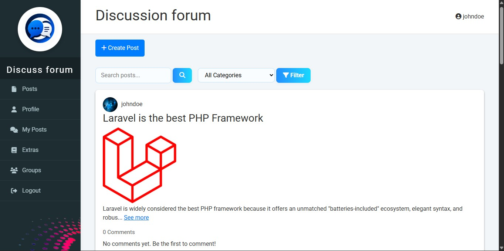
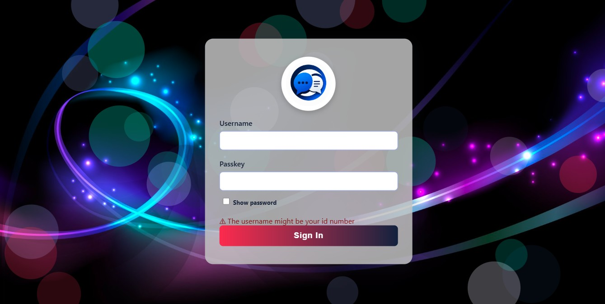
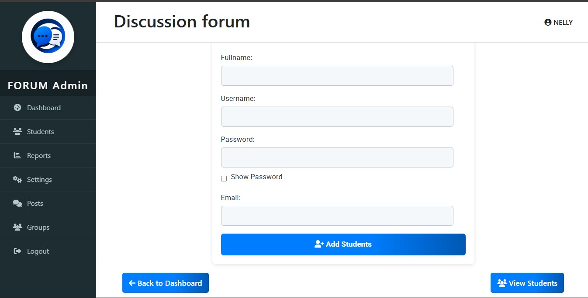
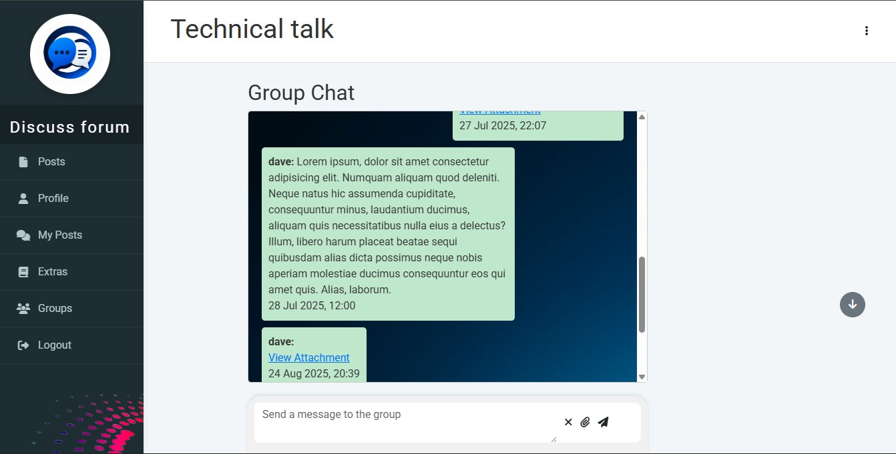
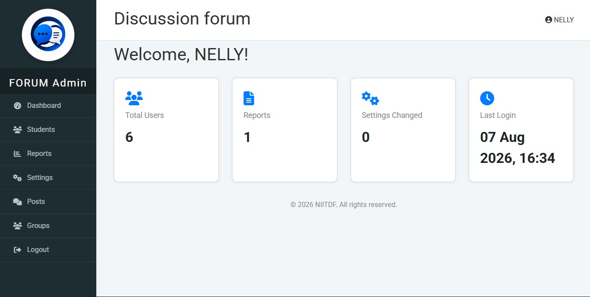

# Discussion Forum

A web-based Student discussion forum built with **PHP** and **MySQL**, allowing Students to log in, create discussions, and interact with other users through comments in a simple, user-friendly interface WHILE admins can add Students and manage the application.

> This project was built before I began learning Laravel and represents my foundation in backend web development. I plan to rebuild it in Laravel as a more scalable and production-ready application.

---

## Features

- User registration and authentication
- Secure login and logout
- Create discussion posts
- Comment on discussions
- Chat on Group
- User profile management
- Admin section
- Responsive interface

---

## Tech Stack

- PHP (Core PHP)
- MySQL
- HTML5
- CSS3
- JavaScript
- XAMPP (Development Environment)

---

## Database

Database Name: discussion_forum

---

## Installation

1. Clone the repository.
```bash
git clone https://github.com/Starkices/discussion-forum.git
```
2. Move the project into your web server directory.
3. Create a MySQL database named:
```
discussion_forum
```
4. Import the SQL database.
5. Configure your database connection.
6. Start Apache and MySQL.
7. Visit:

### User login
```
http://localhost/discussion-forum

```
Username - johndoe
password - dlaw12345

### Admin login
```
http://localhost/discussion-forum/admin

```
Username - NELLY
password - DFnigeria01
---

## Screenshots

### Home Page



### Login



### Registration



### Group chat



### Admin Dashboard



---

## Future Improvements

- Rebuild with Laravel
- REST API
- Email verification
- Notifications
- Rich text editor
- Search improvements
- Better UI/UX
- Improved security

---

## Author

**Wisdom Ogheneobrozie**

GitHub:
https://github.com/Starkices

---

## License

This project is available for learning purposes.